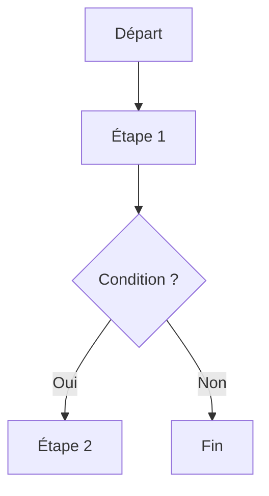
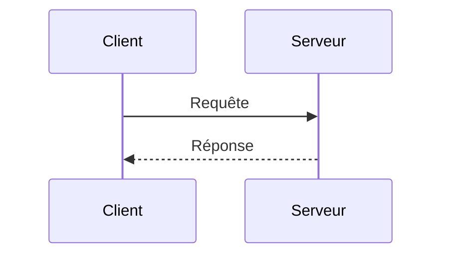
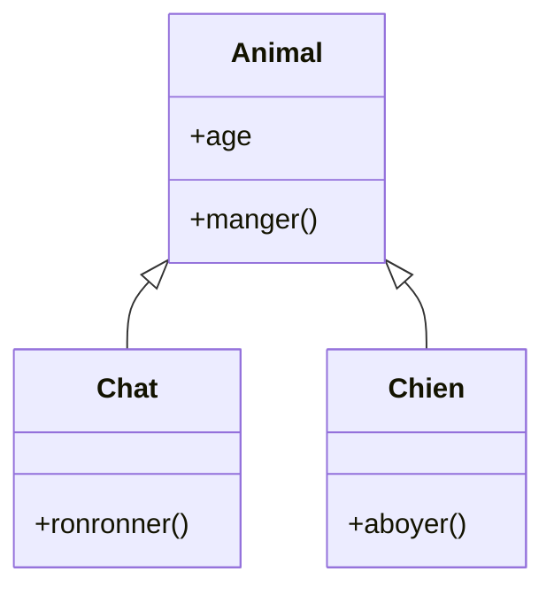
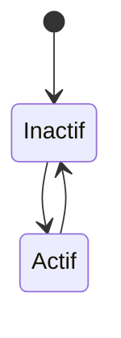
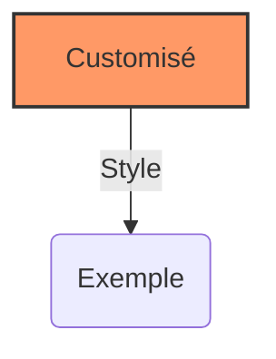

**Mermaid.js : Guide pratique pour créer des diagrammes dynamiques en Markdown**  

**1. Présentation de Mermaid.js**  
Mermaid.js est une bibliothèque JavaScript permettant de créer des diagrammes dynamiques directement à partir de texte écrit en Markdown. C'est particulièrement utile pour générer des schémas facilement intégrables dans la documentation technique (comme sur GitHub, Notion ou MkDocs).  

**2. Installation et utilisation**  
- Si vous utilisez Markdown avec un support intégré pour Mermaid (comme GitHub ou Obsidian), aucun setup n'est nécessaire.  
- Pour un site web ou un projet local, ajoutez le script suivant :  

```html
<script type="module">
  import mermaid from 'https://cdn.jsdelivr.net/npm/mermaid@10/dist/mermaid.esm.min.mjs';
  mermaid.initialize({ startOnLoad: true });
</script>
```

**3. Les types de diagrammes principaux**  

- **Diagramme de flux (Flowchart)**  


- **Diagramme de séquence**  


- **Diagramme de classes UML**  


- **Diagramme d'état (State Diagram)**  


**4. Configuration avancée**  
Vous pouvez personnaliser les styles :  


**5. Conseils d'utilisation**  
- Utilisez des noms courts et clairs pour les nœuds.  
- Structurez vos diagrammes comme des pseudocodes lisibles.  
- Expérimentez avec les différents types pour mieux visualiser vos processus.  

**6. Ressources**  
- [Documentation officielle](https://mermaid.js.org/)  
- [Sandbox en ligne](https://mermaid-js.github.io/mermaid-live-editor/)  

Tu veux que je t’aide à construire un diagramme particulier ? 🚀  